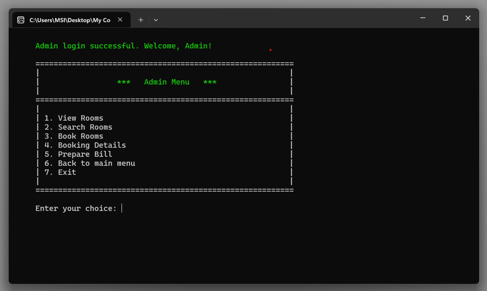

# Moon Hotel Management System

This is a C++ Hotel Management System for managing rooms, bookings, and billing for a hotel. The system provides two modes of operation: **User** and **Admin**. 

## Features
- **User Login:**
  - View available rooms.
  - Book a room.
  - View booking details.
  - Generate a bill.

- **Admin Login:**
  - View all rooms and their statuses.
  - Search for rooms by number.
  - Book rooms on behalf of customers.
  - View booking details of all rooms.
  - Generate billing information for customers.

## Usage

When you start the program, you'll be presented with a menu where you can choose to log in as a user or an admin.

### Main Menu:
1. User Login
2. Admin Login
3. Exit Program

### Login Information:
- **User** login: Username: `user`, Password: `user`
- **Admin** login: Username: `admin`, Password: `admin`

## Admin Features

Once logged in as admin, you have access to the following options:

1. **View Rooms**: View details of all rooms, including room type, AC status, availability, and price.
2. **Search Rooms**: Search for a specific room by its number and view its current status.
3. **Book Rooms**: Book available rooms by entering customer details.
4. **Booking Details**: View details of all current bookings, including customer information.
5. **Prepare Bill**: Generate and view the bill for booked rooms, based on the number of days and room price.

## User Features

After logging in as a user, you can:

1. **View Rooms**: See all available rooms and their details.
2. **Book Room**: Book a room by providing your details (name, NIC, phone number, check-in, and check-out dates).
3. **View Booking Details**: Check your current booking details.
4. **View Bill**: View the bill for your booking.


## Sample Screenshots

Please refer to the following images for a visual guide to the system:

1. **Main Menu**:
   

2. **Admin Menu**:
   

3. **User Menu**:
   

4. **Room Booking**:
   

## Prerequisites
- A C++ compiler (e.g., GCC, MSVC, etc.).
- Basic knowledge of C++ for running and modifying the code.

## Installation

To run the Moon Hotel Management System on your local machine:

1. **Clone the repository**:
    ```bash
    git clone https://github.com/Kaveeshawi/Moon-Hotel-Management-System.git
    ```
2. **Navigate to the project directory**:
    ```bash
    cd Moon-Hotel-Management-System
    ```
3. **Compile the program**:
    If you're using `g++`:
    ```bash
    g++ -o hotel_management main.cpp
    ```
4. **Run the compiled program**:
    ```bash
    ./hotel_management
    ```

## Contribution

Contributions are welcome! If you'd like to contribute, please fork the repository and submit a pull request. If you encounter any issues, feel free to open an issue on the [GitHub repository](https://github.com/Kaveeshawi/Moon-Hotel-Management-System/issues).

## License

Copyright © 2024 Kaveesha Wijesiriwardana
